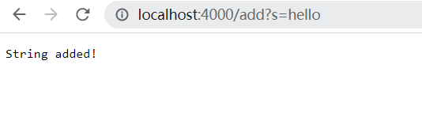

Part1:
The code of StringServer:

The Screenshot of the outcome of adding:Hello

The Screenshot of /add-messag: Hello

The Screenshot of /add-messag: How are you

In this code, the method handleRequest is called with a URI object as an argument.

The relevant argument to this method is the URI object, url, which represents the URL of the incoming request. The method first checks the path of the URL using url.getPath() and based on the path, it performs different actions.

If the path is "/add", it splits the query part of the URL using url.getQuery() and split("=") to get the value of the string to be added. If the first part of the split result is "s", it adds the string to the ArrayList strList using strList.add(parameters[1]).

If the path is "/search", it splits the query part of the URL using url.getQuery() and split("=") to get the value of the string to be searched. If the first part of the split result is "s", it searches the ArrayList strList for the string using a loop and contains method. If the string is found, it adds it to the result string.

If the path is neither "/add" nor "/search", it returns "404 Not Found!".

The values of the relevant field strList change based on the incoming request. If the request is to add a string, the string gets added to the ArrayList. If the request is to search for a string, the ArrayList is searched for the string.

Part2:

Intro: I'm going to introduce a bug from method testReverseInPlace. This method
should reverse the order of the elements in the array. For example, an array with a bunch of elements in 
order 1,2,3 would be reverse to 3,2,1

A failure-including input for the buggy program(testReverseInPlace):

An input that doesn't indce a failure:

The symptom:

The bug before fix:

The code after bug fix:

Before I describe why the fix could address the issue,
I would like to talk about what is the bug of the reverse method:

There are two potential issues in the program that could result in bugs:

1.In the case of a short reverse, the last element of the array will not change after the execution of the code. This is due to the author's oversight in not appending the first index of elements in the original array to the current end of the array.

2.In the case of a long reverse, the elements in the latter half of the array will re-reverse the order after the execution of the code. This is because the array is too long and thus re-reverses itself in the middle. For instance, the array {9,0,0,4,3,8,3,4,0,0,9} would result from {1,2,4,6,7,8,3,4,0,0,9}.

To resolve both of these bugs, a deep copy of the array named 'NewArray' can be created using a for loop. The order of the array can then be reversed according to 'NewArray' using another for loop. This will ensure that all elements are copied and the order of the array is successfully reversed.

Part 3:
In the lab of week3, I learned a lot especially I learned how to use the Junit to proper debug my code.
Before the week3, I only know how to use Junit to find out the location of the bug. Now, I've already understand how to use the Junit to proper check each
part of my code that could highly improve my efficiency on debuging like dividing the test code in to sub-cases and check.
